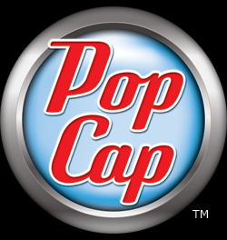

# PopCap Games Framework

## Where am I

This is an archive of PopCap's framework, internally named SexyApp Framework.

Branch `main` has the version that seems to be the closest to what was used for developing Peggle Deluxe and Peggle Nights.

Branch `1.34` has the most up-to-date known version.

## What is this

**PopCap Games Framework** (officially named **SexyApp Framework**) is the name of a computer game development kit for **C++**, released by PopCap Games. It is designed to let programmers easily and quickly create "PopCap-style" games, and is part of their developer program that encourages game creators to distribute their finished games through PopCap Games. The PopCap Games Framework is licensed under a proprietary free license. The PopCap framework powers casual games such as PopCap's own *Bejeweled* and Sandlot Games' *Cake Mania*. The framework only officially runs on Microsoft Windows, although some games have been ported to Mac using proprietary conversions of the framework.

- [Wikipedia](https://en.wikipedia.org/w/index.php?title=PopCap_Games&oldid=866697177)

The name comes from the company's history. PopCap Games was founded by John Vechey, Brian Fiete and Jason Kapalka in 2000. They originally incorporated as 'Sexy Action Cool', a phrase taken from a poster of Desperado. Their first title was a strip poker game called 'Foxy Poker' and was supposed to serve as a revenue stream for their future titles.

- [Wikipedia](https://en.wikipedia.org/wiki/PopCap_Games)

## What is happening

This repo is used as reference material for modding Peggle.

## Aaaaa

For original licensing information, see <a href="PopCap Framework License.md">PopCap Framework License</a> and <a href="Other Licenses.md">Other Licenses</a>.
